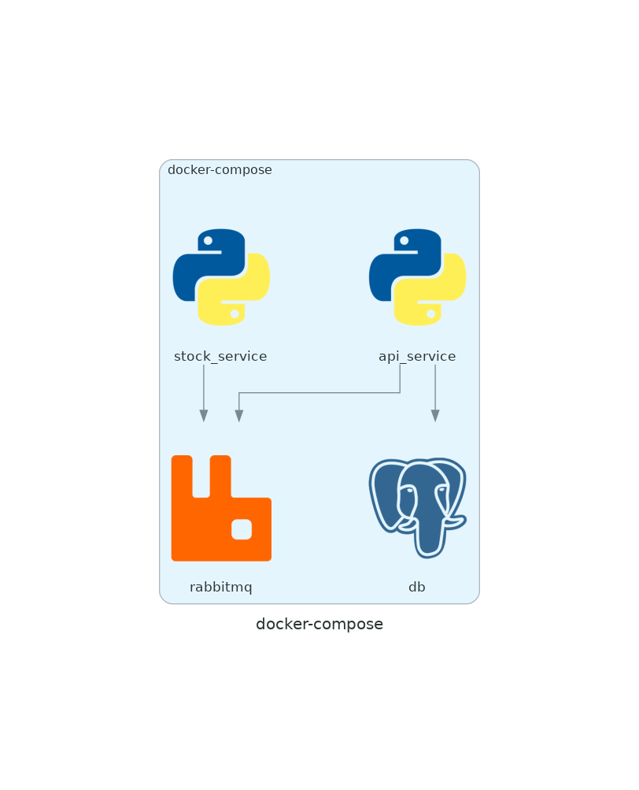

## Description

Microservices running through containers using Django backend.

## Sample users for testing

super user:

user = admin

password = 123456

normal user:

user = peter

password = spiderman

## How to run the project
* Ensure you have docker installed
* Use `docker-compose up` at root.
* Access http://127.0.0.1:8000/api/schema/swagger-ui/

## How to run unit tests

* Ensure you have python3 installed.
* Create a virtualenv: `python3 -m venv virtualenv` and activate it `. virtualenv/bin/activate`.
* Install dependencies: `pip install -r requirements.txt`
* Run unit tests `./stock_service/manage.py test`
* Run unit tests `./api_service/manage.py test`

# How to Use

**Using Swagger**

Access http://127.0.0.1:8000/api/schema/swagger-ui/

Generate a token at /api/token and any of the credentials listed above.

Insert the token at "Authorize" at the top.

Use the "/stock" endpoint to query stock.

Use the "/history" endpoint to see your own query history.

Use the "/stats" endpoint to check up the most queried stocks, requires superuser.

Your access token only lasts 5 minutes, use your refresh token at /api/token/refresh to get a new one.

**Commands below using curl**

`curl -X POST http://127.0.0.1:8000/api/token/ -d "username=peter" -d "password=spiderman"`

This will return two tokens, Access and Refresh. Use Access as a header for all endpoints. Like this:

`curl -X GET "http://127.0.0.1:8000/stock?stock_code=aapl.us" -H "Authorization: Bearer <access_token>"`

Your access token expires in five minutes, so if you need obtain another, use the refresh token:

`curl -X POST http://127.0.0.1:8000/api/token/refresh/ -d "refresh=<refresh_token>"`

`curl -X GET "http://127.0.0.1:8000/stock?stock_code=aapl.us" -H "Authorization: Bearer <access_token>"`

`curl -X GET http://127.0.0.1:8000/history -H "Authorization: Bearer <access_token>"`

`curl -X GET http://127.0.0.1:8000/stats -H "Authorization: Bearer <access_token>"` // must be superuser

Disclaimer: The access token only lasts 5 minutes!

# Considerations

I used postgresql due to popularity, but if we expect the `/stock` endpoint to be called much more often than `/history` and `/stats` I would consider a nosql database for faster writes.

Logging to console is fine for debugging purposes, but in production it's better to have more robust monitoring tools.

User credentials and access tokens should never be hardcoded, this is for illustration purposes only.
